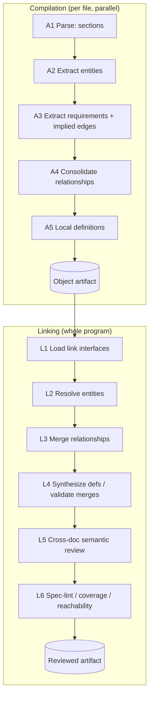

# Jazyk Compiler & Linker — Implementation Plan (Exploratory)

> **Status: exploratory / pre-commitment.** This document captures the architecture we have
> been designing for turning loose natural-language documentation into a queryable, machine-readable
> specification suitable for code generation, test generation, and more. It is meant to be iterated
> on. Nothing here is final; sections marked **[open]** are explicitly unresolved.

---

## 1. Thesis recap

Jazyk treats natural-language documentation as the source code of a program. Rather than constrain
the *syntax* of English, a **compiler** reads loose documentation and surfaces ambiguity,
open-endedness, and contradictions, producing build artifacts that downstream tooling can consume
reliably.

The founding bet (see `docs/main.md`): open-ended prompts to an LLM are unreliable; small, well-defined
ones are not. The compiler's job is to decompose loose docs into many small, well-defined units so
that downstream generation operates in the reliable regime.

Today's docs split documentation into **sections** and try to infer **relationships between
sections**. The core realization of this plan is that *section relationships are the wrong
abstraction* — they break down when a document is not neatly fragmented. Instead:

- Sections carry only **structural** (parent/child tree) relationships.
- All **semantic** meaning is captured as **entities** and **requirements** extracted from the prose,
  plus **relationships between entities**.
- Each documentation file is **compiled independently and in parallel**, then all files are **linked**
  together by resolving shared entities across files.

This is, almost exactly, **separate compilation + linking** as in a real language toolchain.

---

## 2. The mental model: separate compilation + linking

| Real compiler/linker                                 | Jazyk                                                                               |
|------------------------------------------------------|--------------------------------------------------------------------------------------|
| Source file (`.c`)                                   | Documentation file (`abc.md`)                                                        |
| Lex/parse → AST                                      | Section split → section tree                                                         |
| Translation unit                                     | One compiled doc                                                                     |
| **Symbol** (a name binding)                          | **Entity name** (resolution handle)                                                  |
| Declaration                                          | Entity *mentioned/referenced* in a doc                                               |
| Definition                                           | Entity *specified* in a doc                                                          |
| Statement/assertion over symbols                     | **Requirement** (EARS) over entities                                                 |
| Reference/dependency between symbols                 | **Relationship** between entities                                                    |
| Object file `.o` (symbol table + code + relocations) | **Object artifact** (entities + requirements + relationships + unresolved externals) |
| Local (`static`) symbol                              | **Internal** entity (private to one doc)                                             |
| Exported/`extern` symbol                             | **External** entity (part of a doc's link interface)                                 |
| Linker resolves symbols across `.o`                  | Linker resolves entities across docs                                                 |
| Undefined-symbol error                               | Dangling / undefined entity                                                          |
| Duplicate / ODR violation                            | Conflicting cross-doc definition                                                     |
| Whole-program analysis / LTO                         | **Post-link semantic review** of all requirements per entity                         |
| Symbol table / map file                              | Global entity graph (queryable)                                                      |
| Incremental build (make)                             | Per-doc recompile + re-link                                                          |
| Linker script / explicit `extern`                    | **Explicit link directives** (human disambiguation)                                  |
| Static-analyzer issue baseline / suppressions        | **Sticky persisted diagnostics** (§5.11)                                             |
| Unused-symbol / dead-code / unreachable-code warnings | **Unused / unreachable entity warnings** (§L6)                                       |

The value of the analogy is operational: it tells us **where each kind of work belongs**.

- Work needing only one document → **compile time** → embarrassingly parallel, content-addressed,
  cacheable per file.
- Work needing the whole program → **link time** and **post-link** → entity resolution, cross-doc
  consistency, the relationship graph, global queries.

### 2.1 "Entity" vs "Symbol" — naming **[decision, revisitable]**

We keep **Entity** as the primary semantic term and reserve **symbol / symbol table** for the
resolution machinery. Reasoning: a compiler *symbol* is a bare name binding with no internal
structure, whereas a Jazyk *entity* is a rich node (synthesized definition, member fields,
relationships, requirements) — closer to a *type* or *declaration* than to a *symbol*. The entity's
**name + aliases** play the role of symbols during resolution, and the global name→entity index is
genuinely a **symbol table**. So we get both: meaningful domain vocabulary *and* the compiler
alignment where it actually fits.

---

## 3. Object model — the node types

Four node types. The first is structural; the other three are the semantic graph.

### 3.1 Section (structural)
A unit of the document's structure (a heading and its body, a list item, a code block, a diagram).
Sections form a **tree** (parent/child only — no inferred semantic edges). Sections exist for:
- **provenance** — every entity/requirement traces back to the section (and char span) it came from;
- **reconstruction** — verbatim `raw` text + ordering lets us rebuild the original document;
- **navigation** — "show me the documentation context around entity X" resolves to sections.

### 3.2 Entity (a.k.a. symbol)
A domain concept of any granularity: a component, a field, a product, a "shoe." Entities are
**extracted by an LLM** (not authored in a fixed format — docs stay flexible). An entity has:
- a **name** + **aliases** (resolution handles);
- a **linkage class**: **internal** (private to one doc) or **external** (part of the doc's link
  interface — visible to other docs); see §5.5;
- a **local (partial) definition** per doc — "what this doc knows about it so far" (§5.6);
- a **global (synthesized) definition** — produced *after* linking from all linked facts (§5.6);
- **provenance** (source sections/spans) and **confidence**;
- a **scope** (§5.4) to avoid wrongly merging distinct same-named concepts.
- optional **reasoning** — the *why* it exists/its purpose, when the docs explain it (§5.10).

Entities are **declared** (merely mentioned) or **defined** (authoritatively specified) in a given
doc — the decl/def distinction drives ownership and diagnostics.

### 3.3 Requirement
An **EARS** statement attached to one or more entities (and optionally to a relationship). EARS
(Easy Approach to Requirements Syntax) covers both **behaviors** and **constraints**:
- ubiquitous — "The system shall ensure each `User` email is unique" (an invariant);
- event-driven — "When `<trigger>`, the system shall `<response>`";
- state-driven — "While `<state>`, …"; unwanted — "If `<condition>`, then …"; optional — "Where
  `<feature>`, …".

The requirement stores the EARS **text** plus its **parsed pattern** (trigger/state/condition/response)
and structured **entity references**. The behavior-vs-constraint "kind" is a **derived facet** of the
EARS pattern — we do not maintain a separate requirement taxonomy. A requirement also carries
provenance, confidence, and optionally a **verification method** (a hint for test generation). It may
also carry **reasoning** — the *why* the docs give for it (§5.10).

### 3.4 Relationship (first-class) **[decision: yes, make it its own object]**
A typed edge between two (or more) entities, **reified as its own object** rather than left implicit
in requirements. Rationale:
- a relationship is the **materialized projection of the requirements that tie those entities
  together**, with its own consolidated properties (type, cardinality, direction, provenance,
  confidence, optional reasoning);
- it enables the queries we want — "give me the requirements **between** A and B", "give me A and
  **all its relationships**";
- relationships are discovered at different times (within a doc at compile time; across docs at link
  time) and need a stable object to accumulate onto;
- relationship **type** reuses the existing UML taxonomy
  (`generalization → realization → composition → aggregation → association → dependency → reference`,
  see `docs/compiler/build-artifacts/relationships.md`) and can be **promoted** from the weak default
  `reference` to a stronger type as evidence accrues — same promotion idea, now on entity edges.

**Edges are a product of requirements** — there are no orphan edges. A relationship exists *only*
because one or more requirements tie its entities together; any requirement that references 2+
entities **produces (or contributes to) an edge** among them, with **at minimum a weak `reference`**
(the entities merely share something — e.g. *"all cars are blue"* ties `Car` and `Color` with nothing
structural). Consequences:
- the edge's **type is the strongest one implied across all its requirements** (promoted from
  `reference` toward composition/dependency/etc. as the requirements warrant);
- the edge's **requirements are exactly those that mention the pair**, so "give me the requirements
  between A and B" is always well-defined and non-empty, and every edge carries provenance for free;
- nothing creates edges *except* requirements. A diagram arrow or a structural sentence ("A is part of
  B") is captured **as a requirement** tying the entities, which then yields the edge like any other —
  one single source of edges.

Core relationships are **binary**; an n-ary requirement (covers A, B, C) contributes to the pairwise
edges (A–B, A–C, B–C) and remains attached to all three entities. True n-ary (hyperedge) relationships
are **[open]** — supported only if a real need appears.

### 3.5 Diagnostic (first-class, persisted) **[new]**
A judgment the compiler made about the spec — a contradiction, ambiguity, fragmentation, etc.
Diagnostics are **not** regenerated from scratch each build; they are **persisted with stable
identity** and reconciled across recompiles (§5.11), so IDE views, triage, and suppressions stay
stable. A diagnostic has:
- a stable **id** + **fingerprint** (what it is *about*, independent of LLM wording);
- a **rule** (catalog, §8) and a **severity**: `error | warning | info | none` (`none` = a *considered*
  judgment deliberately not surfaced, §5.10);
- **subjects** — the node(s) it concerns (entity / requirement / relationship / section ids);
- a **message** (human-facing) and **reasoning** (why this severity/disposition was chosen, §5.10);
- a **lifecycle** state (`open | resolved | superseded | merged`) and a human **triage** state
  (`acknowledged | suppressed | wontfix`) that **survives recompilation**;
- **provenance**, **confidence**, `firstSeen`/`lastSeen` build markers, and links to merged/related
  diagnostics.

---

## 4. Pipeline overview



---

## 5. Key concepts

### 5.1 Two-stage linking: deterministic resolution, then semantic validation
A real linker resolves by exact mangled name. Ours splits the job in two so the mechanical part stays
fast and reproducible and the fuzzy part is auditable:

- **L2 — deterministic resolution.** Links via explicit references and **exact (normalized) names**
  only, in tiers (direct-link+name → direct-link/section-mismatch → name-only), assigning stable global
  ids. It is **conservative**: it never fuzzy-matches or guesses typos (`Cutsomer` ≠ `Customer` → a
  `missing-link`, not a correction), and it makes **no semantic judgment** about whether a match is
  truly right. No LLM, no embeddings.
- **L4 — merge validation via synthesis.** Trying to synthesize one coherent definition for a merged
  entity *is* the test: if the members can't form one coherent definition, a `name-only` merge is a
  **false merge** (same name, distinct things) → split (rename, or add an explicit link).
- **L5 — semantic linkage review.** The LLM then **finds missing links** (different names, same thing)
  and reviews contradictions among confirmed-same entities. This is the "is anything *else* wrong?" stage.

So L2 errs toward *under*-linking by name; L4 catches over-merges (false merges) at definition time, and
L5 catches the inverse (missing links) plus contradictions. Severity scales with the degree of
ambiguity (§5.10).

### 5.2 Confidence & provenance everywhere
Because extraction and resolution are LLM-driven, every entity, requirement, relationship, and link
carries a **confidence** and **provenance** (source doc/section/char-span). This makes the artifact
honestly probabilistic: high-confidence facts can be acted on automatically; low-confidence ones drive
warnings and human-in-the-loop review.

### 5.3 Stable identity & rename detection **[hard problem]**
Downstream artifacts (generated code, tickets, tests) bind to entity ids. If the LLM re-IDs or renames
entities each run, everything downstream churns. We need:
- a **stable id scheme** (canonical name + scope + alias table; *not* the raw extracted string);
- **rename detection** — the entity-level analog of section "move" detection, so a renamed entity keeps
  its id and downstream bindings survive.

### 5.4 Scopes / namespaces **[important]**
Naive "merge by name" is C-with-no-namespaces: it will wrongly fuse two distinct "Order" concepts from
different bounded contexts. The linker must be able to **keep entities apart**, not only merge them.
Scopes (likely derived from directory/bounded-context, with explicit override) prevent over-merging.
Maps cleanly onto DDD bounded contexts.

### 5.5 The link interface: internal vs external entities **[scalability]**
We likely cannot load every object file's full contents into context to link. Each compiled doc
therefore exposes a small **link interface**:
- **Internal** entities — referenced only within this doc (private, like `static`); never loaded by the
  linker.
- **External** entities — shared/exported; the linker loads only these, with their **local
  definitions**, the **relationships among them**, and any **relocations** (explicit cross-file links).

This is exactly how a real linker reads symbol tables, not full source. The internal/external split is
itself a heuristic (a cross-file markdown link ⇒ external; a prominent/defined term ⇒ external; an
incidental mention ⇒ internal), refined by the linker (anything matched across files is external).
Conservative default: expose as *external candidate* and tune for noise.

### 5.6 Local (partial) vs global (synthesized) definitions
Two levels of "definition," reconciling scalability with quality:
- **Local definition** (compile time, per doc): what one doc says about an entity — the matching
  surface the linker compares during resolution ("what we know so far").
- **Global definition** (post-link): the canonical, merged definition + aliases, synthesized from the
  union of all linked facts. Produced during Linking (L4), once all facts are available.

### 5.7 Granularity tuning **[open]**
"A field is an entity" is elegant (a field relates to its parent by composition — no new concept) but
risks entity explosion. Partly mitigated by internal/external classification (incidental fields stay
internal). Treat granularity as a **tunable**; consider a dedicated, more deterministic entity-only
extraction pass (§6, A2) whose output we can later tune, discard, or extend. Open to better ideas.

### 5.8 Flexibility — no fixed document format
Docs are prose, not a schema. The compiler copes with loose input and only asks the human when it
genuinely cannot resolve something, via **explicit link directives** (the linker-script escape hatch):
assertions like "`ABC`@doc1 ≡ `ABC`@doc2" or "these are distinct." These are authoritative, suppress
the corresponding warning, and persist so the question is never re-asked.

### 5.9 Link-time feedback (handled in Linking's validation, L5)
A requirement in one doc may be incomplete or misleading until a requirement from another doc is seen
(e.g. doc1: "entity A has 3 wheels" ⇒ reads like a tricycle; doc2: "A is a 3-wheeled motorcycle").
Because L5 reviews **all requirements grouped per entity after linking**, this cross-doc
incoherence is caught there — no separate two-pass re-extraction is required for correctness (though an
optional re-extraction pass remains possible if recall disappoints; that is LTO/PGO-style and **[open]**).

### 5.10 Reasoning **[new]**
A single concept: **reasoning** is the *why* behind a decision, stored alongside whatever it explains.
It appears in two places but is one idea — the justification for a choice:
- on a **requirement / entity / relationship** — why it exists or is shaped that way, often drawn from
  the docs' own explanation ("email must be unique **because** it is the login identifier"). It aids
  codegen decisions and human review, and carries provenance like any extracted fact.
- on a **diagnostic** (§3.5) — why the compiler emitted an error, a warning, or nothing at an
  ambiguity point. Because the compiler is LLM-backed and probabilistic, recording this makes its
  calls auditable.

The outcome of an ambiguity is graded by how much ambiguity remains; the chosen disposition **and its
reasoning** are recorded:

| Ambiguity | Disposition | Recorded as |
| --- | --- | --- |
| none / trivial | silent | nothing |
| small but non-trivial | `none` (considered) | a diagnostic with severity `none` + reasoning (hidden in IDE by default) |
| moderate | `warning` | a diagnostic + reasoning |
| high / contradictory | `error` | a diagnostic + reasoning |

The `none`/"considered" record is **optional and threshold-gated** to avoid bloat — kept only when the
ambiguity is meaningful enough that a human or a later build might revisit it. It also gives
**continuity**: if a later build tips the same situation into a warning, the prior "considered
because X" reasoning carries forward.

### 5.11 Sticky / persisted diagnostics **[important]**
Diagnostics must be **stable across recompilations**. A naive LLM re-run re-words, re-ids, and
re-orders findings every build — churning IDE views, breaking triage/suppressions, and making diffs
noisy. Instead:
- Diagnostics are **persisted** in a diagnostics store (§7.4), keyed by a **stable id/fingerprint**
  derived from *what the issue is about* (rule + subject node ids + a coarse semantic fingerprint),
  **not** from the LLM's phrasing.
- On recompile, diagnostic-emitting stages **reconcile, not regenerate**: each stage is given the prior
  diagnostics for the invalidated scope and decides per finding to **keep / update / resolve / merge /
  split**, adding **new** diagnostics only for genuinely new issues. Survivors keep their id and
  (unless materially changed) their wording and reasoning.
- **Human triage survives** — `suppressed` / `wontfix` / `acknowledged` is bound to the diagnostic id
  and never lost. That is the point of stickiness: triage once.

**Relation to determinism/caching (§10.7):** two complementary mechanisms — the content-hash *cache*
skips work when nothing changed; *reconciliation* evolves diagnostics when something did, preserving
identity and triage. Reconciliation is **scoped to the invalidation set**, so it stays incremental.
The same stickiness applies to **reasoning and synthesized definitions** — updated only when
materially changed, never re-worded for its own sake.

---

## 6. Detailed steps

Conventions for every step: deterministic work is done **without** an LLM; LLM stages use **structured
output** + deterministic decoding, are **cached** by a content-hash key, and **reconcile** diagnostics
rather than regenerate them (§5.11). Crucially, each LLM stage gets the **smallest scope that
suffices** — a single section, or a single entity with its requirements — *never* the whole project.
This is the small-prompt thesis (`docs/main.md`) applied to the compiler itself: narrow, well-defined
context is what makes the LLM stages reliable and cheap. Each step states its **LLM scope** (what the
model literally sees) and **cache key**.

**Cache storage (revised).** The cache is no longer a hash-named blob store. The source-mirrored build
tree lives under `<out>/target/`: each doc gets a directory named after it (extension kept, e.g.
`target/docs/cli.md/`) holding one **YAML** file per compile stage — `sections.yaml` (A1),
`entities.yaml` (A2/A5), `requirements.yaml` (A3, keyed per-section), `object.yaml` (A4, the `.o`).
Whole-program link stages live under `target/link/` (`<entity-slug>.synthesis.yaml` for L4,
`<entity-slug>.review.yaml` for L5). The finals sit at the out-dir root: `linked.yaml`,
`reviewed.yaml`, `diagnostics.yaml`. Each `target/` file carries a `# jazyk:` header comment holding
the step's cache key; a step is skipped when the recomputed key matches. These files **are** both the
build output and the cache (the old `objects/*.json` + `cache/*.json` split is gone). Tradeoff: only
the latest result per file/stage is kept, so reverting a doc edit recomputes rather than restoring an
older cached result. See `docs/compiler/artifacts.md#storage-layout`. The out-dir-root finals are
rewritten by **every** completed whole-program build, not only `jazyk build`: the **LSP** persists them
after each build so a separate **MCP** process (or CI) reads the same build the editor sees. See
`docs/lsp/lifecycle.md#persisted-output`.

### Compilation (per file, parallel, cacheable by file content hash)

**A1. Parse → sections.** *Deterministic, no LLM.*
- **Purpose:** turn a file into a section tree (structure only) + verbatim text for reconstruction.
- **Produces:** a **map of section reference → section**. The reference is the **file-internal path
  only** — the fragment *after* `#` (e.g. `/abc/required-fields/0`), not a full URI. The file is
  implicit (it is the doc being compiled); the full location URI is assembled on demand as
  `sourceFile + "#" + ref`. Each section carries `title, raw, order, kind, parent` (where `parent` is
  itself an internal reference). Cross-*file* references never appear here — those are relocations
  resolved at link time (§5.5).
- **Checks / emits:** unsupported format (no handler) → warn/error; parse failure → error; empty file
  → warn.
- **Implementation:** deterministic, format-specific handler (e.g. the Markdown parser). Walks the
  document, assigns each section its internal reference path, and emits the map with char-spans,
  `order`, and `kind`, plus per-section content hashes and the file hash.
- **LLM scope:** none — no model involved.
- **Cache key:** file content hash.

**A2. Extract entities.** *LLM; candidate for a dedicated, more deterministic pass.*
- **Purpose:** extract candidate entities mentioned anywhere; assign provisional internal/external
  class; attach provenance spans + confidence; mark decl vs def.
- **Produces:** an **entities map** (localId → entity: name, aliases?, linkage, decl/def, provenance,
  confidence).
- **Checks / emits:** low-confidence entity → warn; intra-doc name clash (same name, two meanings in
  one doc) → warn.
- **Implementation:** LLM extraction with structured output, ideally a dedicated low-temperature pass
  so the entity set is stable run-to-run; results are reconciled against the prior object artifact so
  entity local-ids stay sticky.
- **LLM scope:** the **whole document** — the model must see entities mentioned anywhere to dedup them
  and judge internal-vs-external. For files too large for the context window, chunk by top-level
  sections and add a doc-level **merge pass** that unifies duplicates across chunks. It sees this
  doc's prose only — never other docs.
- **Cache key:** file content hash + model id + prompt version.

**A3. Extract requirements (+ the edges they imply).** *LLM.*
- **Purpose:** for each section, extract EARS requirements; link each to 1+ entities; parse the EARS
  pattern; attach provenance, confidence, optional verification method. **As a byproduct, every
  requirement that references 2+ entities emits the relationship edge(s) it implies** among them — at
  minimum a weak `reference`, stronger when the requirement warrants it (§3.4). Edges come *only* from
  here; diagram arrows and structural sentences are captured as requirements so they flow through the
  same path.
- **Produces:** `requirements[]` (id, earsText, pattern{…}, entityRefs[localId], impliedEdges[{members,
  type}], sourceSection, provenance, confidence).
- **Checks / emits:** vague/open-ended statement that cannot be cast as EARS → warn ("not
  verifiable/ambiguous"); requirement with no entity → warn; intra-section contradiction → warn.
- **Implementation:** LLM per section, structured output; each requirement is matched to entities from
  the doc's table by name/alias, and the same call names the entity pairs it ties + their implied type.
- **LLM scope:** **one section's text** + the doc's **entity table** (names + aliases, so requirements
  can be linked) + the section's **ancestor titles** (breadcrumb). Deliberately *not* the whole file —
  small prompt, well-defined task, sections run in parallel.
- **Cache key:** section content hash + entity-table hash + model id + prompt version.

**A4. Consolidate relationships.** *Mostly deterministic.*
- **Purpose:** materialize the edges. Group the per-requirement `impliedEdges` by entity pair, **union
  their requirements**, and compute the **strongest implied type** for each pair (promotion from
  `reference`); derive cardinality where the requirements state it. No independent extraction — this
  only consolidates what A3 produced.
- **Produces:** `relationships[]` (localId, type, members[localId], cardinality?, requirements[id],
  provenance, confidence).
- **Checks / emits:** conflicting implied types for a pair → resolve to the strongest, or warn if
  genuinely contradictory.
- **Implementation:** deterministic grouping/union; an LLM is used only to **reconcile a type conflict**
  or infer cardinality when the requirements are ambiguous.
- **LLM scope:** per pair only, the **requirements tying that pair** + the candidate types — never prose.
- **Cache key:** the contributing requirements' hashes (+ model id if type reconciliation ran).

**A5. Local definitions.** *LLM.*
- **Purpose:** for each external entity, synthesize this doc's partial definition (the linker's
  matching surface).
- **Produces:** `localDefinition` per external entity.
- **Implementation:** LLM summarization per external entity, structured output.
- **LLM scope:** for one entity, only the **slices of this doc that mention it** (gathered via the
  entity's provenance spans) + its requirements — not the whole file. Produces a tight "what this doc
  says about X," which is the matching surface the linker compares.
- **Cache key:** hash of that entity's contributing spans + model id + prompt version.

**Object artifact** (Compilation output, one per doc): see §7.1.

### Linking (whole program)

The linker runs over all object artifacts in two sub-stages: **resolve across files** (L1–L3), then
**validate the merged graph together** (L4–L6).

**Resolve across files (L1–L3):**

**L1. Load link interfaces.**
- **Purpose:** load only external entities + local definitions + relationships among externals +
  relocations from each object — not full docs (scalability).
- **Produces:** in-memory link set.
- **Implementation:** deterministic I/O. Reads each object artifact's **link interface** only —
  external entities, their local definitions, relationships among externals, and relocations — never
  full doc bodies. This is the scalability guarantee (§5.5).
- **LLM scope:** none.
- **Cache key:** the set of contributing object-artifact hashes.
- **Example:**
```yaml
# consumes: the set of object artifacts
[ abc.md.object, customer.md.object ]
# produces: link interfaces only (externals + local defs + edges among externals + relocations)
linkInterfaces:
  abc.md:
    externals:
      - { localId: e1, name: Customer, localDefinition: "the buyer who places an order",
          relocation: "customer.md#/customer-definition" }
      - { localId: e2, name: Order, localDefinition: "a purchase a customer places" }
    edges: [{ members: [e1, e2], type: reference, requirements: [r0] }]
  customer.md:
    externals:
      - { localId: e0, name: Customer, role: definition, definedIn: "/customer-definition",
          localDefinition: "a person or organization that holds an account" }
```

**L2. Resolve entities.** *Deterministic and conservative — semantic judgment is deferred to Linking.*
- **Purpose:** decide which external entities across docs are the same, using **only links and exact
  names**; assign **stable global ids**; respect **scopes**; record each entity's members and *how* it
  was resolved (the tier). L2 does **not** judge whether a match is semantically correct — that is
  Linking's job (§L5).
- **Resolution tiers** (strongest first; explicit link directives apply before all and are authoritative):
  1. **direct link + name match** → a relocation points at `customer.md#/customer-definition` and that
     section defines an entity of the **same name** (`Customer`). Confident link, no warning.
  2. **direct link, section mismatch** → the relocation points into `customer.md` but the same-named
     entity is defined under a *different* heading → link, **warn** (`link-section-mismatch`).
  3. **name match, no link** → no relocation, but the same name is an entity in 2+ docs → link and
     **warn** (`name-only-link`: "linked by name only; add an explicit link to confirm").
  - **unresolved** → an external that matches nothing by link or exact name → **warn** (`missing-link`).
    We do **not** fuzzy-match or guess typos: `Cutsomer` does not auto-correct to `Customer`; it is
    simply a missing link for a human (or Linking) to resolve.
- **Produces:** the global entity table (symbol table) — each global entity with members + resolution
  tier — plus resolution diagnostics.
- **Implementation:** purely deterministic — follow relocations, compare exact (case/whitespace-
  normalized) names within scope. **No LLM, no embeddings, no edit-distance.** Global ids assigned with
  **rename detection** so ids stay stable across builds (§5.3).
- **LLM scope:** none.
- **Cache key:** the link-interface hashes + applicable directives.
- **Example:**
```yaml
# consumes (from L1): the two link interfaces above
# produces: one global entity, resolved by tier 1
entities:
  "ent:Customer":
    canonicalName: Customer
    scope: "<scope>"
    members:
      - { object: customer.md, localId: e0, role: definition }
      - { object: abc.md,      localId: e1, role: reference }
    resolvedBy: direct-link        # tier 1 -> no warning
  "ent:Order":
    canonicalName: Order
    members: [{ object: abc.md, localId: e2, role: definition }]
diagnostics: []   # tier 2 -> link-section-mismatch; tier 3 -> name-only-link; no match -> missing-link
```

**L3. Merge relationships (re-key edges to global entities).** *Mostly deterministic.*
- **What is "resolved" here:** A4's per-doc edges point at **local** entity ids (`e1`, `e2`) that mean
  something only inside one object artifact. L3 **re-keys** each edge's endpoints to the **global** ids
  L2 assigned, then **merges** edges that now connect the *same global pair* across docs — unioning
  their requirements and recomputing the strongest type. Nothing new is extracted; this is the edge
  counterpart of L2 (L2 resolves *nodes*; L3 resolves edge *endpoints* and merges duplicates).
- **Produces:** the global relationship graph (edges keyed by global entity pair).
- **Implementation:** deterministic re-key + group-by-global-pair + union requirements + strongest-type
  selection. An LLM runs only to reconcile a genuine type conflict (rare).
- **LLM scope:** when needed, only the **conflicting edge's candidate types + its requirements** — not prose.
- **Cache key:** resolved-entity-id set + contributing edge hashes (+ model id if reconciliation ran).
- **Example:**
```yaml
# consumes: per-doc edges (local ids) + L2's localId -> globalId map
abc.md.edges:      [{ members: [e1, e2], type: reference,   requirements: [r0] }]   # Customer–Order
customer.md.edges: [{ members: [e0, e5], type: association, requirements: [r3] }]   # Customer–Order
map: { abc.md/e1: ent:Customer, abc.md/e2: ent:Order, customer.md/e0: ent:Customer, customer.md/e5: ent:Order }
# produces: one merged global edge — endpoints resolved, requirements unioned, strongest type wins
relationships:
  "rel:Customer~Order":
    members: [ent:Customer, ent:Order]
    type: association            # strongest across {reference, association}
    requirements: [req:abc.md:r0, req:customer.md:r3]
```

**Linked artifact** (intermediate — after resolve, L3): see §7.2.

**Validate together (L4–L6):** with entities now resolved, the linker validates the merges and reviews
the merged graph (per entity & per relationship).

**L4. Synthesize definitions — and validate the merge.** *LLM per entity; synthesis IS the merge check.*
- **Purpose:** for each entity L2 merged, attempt to synthesize **one coherent global definition** from
  all members' local definitions + requirements. The attempt *is* the validation:
  - **coherent** → emit `globalDefinition` + `aliases`; the merge is confirmed.
  - **incoherent** (members describe incompatible things — "a person with an account" vs "a row in the
    CRM export") → the merge is wrong, and how it is reported depends on **how L2 merged them**:
    - merged by **`name-only`** (a weak guess) → **`false-merge` / clashing-names error**: split them.
      The message offers the fix — **rename** one if they are genuinely different, **or** add an
      **explicit link directive** to assert they are the same (which reclassifies the incompatibility as
      a contradiction for L5, not a merge error);
    - merged by **explicit/direct link** (an author asserted they are the same) → trust the link and
      *do* synthesize; any incompatibility is left to L5 as a **contradiction**, not a false merge.
- **Produces:** per entity, either `globalDefinition` + `aliases`, **or** a `false-merge` diagnostic + a
  split into distinct entities.
- **Implementation:** LLM synthesis per entity, structured output, sticky (§5.11). The same call writes
  the definition, judges coherence, and (for name-only merges) raises false-merge.
- **LLM scope:** for one entity, **all its now-linked facts** + **how it was merged (L2 tier + members)**
  — every doc's local definition + every requirement referencing it + its relationships. Scoped to one
  entity, never the project.
- **Cache key:** entity membership + member (def/req) hashes + L2 tier + model id + prompt version.
- **Example:**
```yaml
# consumes: a name-only-merged entity's facts + how L2 merged it
ent:Customer:
  resolvedBy: name-only
  members:
    - { customer.md: "a person or organization that holds an account" }
    - { crm.md: "a row in the CRM export table" }
  requirements: [ ... ]
# produces: incoherent + name-only -> false merge (no definition), with actionable resolutions
diagnostics:
  - { rule: false-merge, severity: error,
      message: "customer.md 'Customer' (account holder) and crm.md 'Customer' (CRM export row) cannot form one coherent definition — clashing names. Fix: rename one if they are different, or add an explicit link in the docs to force them together (then any conflict is reviewed as a contradiction).",
      subjects: [ent:Customer] }
splits:
  - { split: ent:Customer, into: [ent:Customer@customer.md, ent:Customer@crm.md] }
# a coherent entity instead yields:
# ent:Customer: { globalDefinition: "A person/org that holds an account and places orders.", aliases: [Customer, buyer] }
```

**L5. Cross-doc semantic review.** *LLM, requirements grouped per entity/relationship; runs on entities L4 already validated.*
- **Purpose:** the whole-program "type check," on entities whose merges L4 confirmed coherent (false
  merges were already split out in L4). Reading all requirements for an entity together, it finds:
  - **missing link** — entities left separate that are actually the **same** concept despite *different*
    names (e.g. `buyer` vs `Customer`) → suggest/create the link → warn (the semantic counterpart L2
    deliberately doesn't attempt; L4 catches false merges, L5 catches the inverse);
  - **contradictions** (the tricycle vs 3-wheeled-motorcycle case — a confirmed-same entity whose
    requirements conflict) → error/warn by severity;
  - **redefinition** / conflicting definitions across files → warn/error;
  - **overlapping / duplicate** requirements across files → warn;
  - **fragmentation** — an entity thinly spread across many files → warn + suggestion ("consider
    extracting `A` into its own file");
  - **incompleteness** — a requirement that only makes sense combined with another; if the combination
    is coherent → info, if confusing → warn/error;
  - general **incoherence / weird behavior** → warn.
- **Produces:** diagnostics attached to entities/relationships/requirements; suggested links.
- **Implementation:** LLM review per entity (and per relationship), structured output, **reconciling**
  against that entity's prior diagnostics (§5.11) rather than regenerating.
- **LLM scope:** **one entity (symbol) with all its requirements grouped across docs** + its
  synthesized definition + **how it was linked (the L2 tier + members)** + **its existing diagnostics**
  (for sticky keep/update/resolve/merge). The model sees the symbol and its statements — *not* the
  source files. This is the "symbols only, with reasoning" scope: the tricycle-vs-motorcycle
  contradiction is visible because both docs' requirements for `ABC` sit side by side, with no raw
  prose needed.
- **Cache key:** entity's grouped-requirements hash + definition hash + linkage (members+tier) hash +
  prior-diagnostics id-set + model id + prompt version.
- **Example:**
```yaml
# consumes: a L4-validated entity + its grouped requirements
ent:ABC:
  globalDefinition: "..."
  requirements: [ ...grouped across abc.md, xyz.md... ]
# produces: a contradiction within a confirmed-same entity, plus a missing link found elsewhere
diagnostics:
  - { rule: cross-doc-contradiction, severity: error,
      message: "abc.md implies ABC is a tricycle (3 wheels); xyz.md states ABC is a 3-wheeled motorcycle.",
      subjects: [ent:ABC] }
  - { rule: missing-link, severity: warning,
      message: "'buyer' (abc.md) and 'Customer' (customer.md) appear to be the same entity but were not linked.",
      subjects: [ent:buyer, ent:Customer] }
```

**L6. Spec-lint / coverage / reachability.** *Configurable, plain-English rules + deterministic graph queries.* **[open]**
- **Purpose:** whole-program checks over the global graph:
  - **reachability & usage (dead-code analog)** — flag entities that are **neither a declared root nor
    reachable from one**. A component defined in a file but referenced *nowhere* (no incoming edge, no
    other requirement mentions it) → **`unused-entity`** warning on that entity; a disconnected island
    reachable from no root (e.g. A↔B that nothing else points to) → **`unreachable-entity`** warning.
    This is the exact analog of unused-symbol / dead-code / unreachable-code warnings (and
    `--gc-sections` / tree-shaking).
  - **fitness functions** — plain-English architectural rules: "every persisted entity declares a
    uniqueness constraint", "no entity depends on >N others", etc.
  - **coverage** — requirements with no derivable test, entities with no behavior.
- **Produces:** configurable warnings/errors; coverage report.
- **Implementation:** reachability and coverage are deterministic **graph queries** (a traversal from
  the roots — see [roots, §10](#10-open-questions--decisions-to-make)); plain-English fitness rules are
  evaluated by an LLM per matching graph slice (like §4 linting, but over the entity graph).
- **LLM scope:** per rule, only the **graph slice it targets** (an entity + its relationships +
  requirements) — not prose.
- **Cache key:** rule text + targeted graph-slice hash + model id.
- **Example:**
```yaml
# consumes: the graph + configured rules
rule: "every persisted entity must declare a uniqueness constraint"
# produces
diagnostics:
  - { rule: unused-entity, severity: warning,
      message: "ent:LegacyWidget is defined in widgets.md but referenced by no requirement or relationship anywhere.",
      subjects: [ent:LegacyWidget] }
  - { rule: spec-lint/uniqueness, severity: warning,
      message: "ent:Order is persisted but declares no uniqueness constraint.", subjects: [ent:Order] }
coverage:
  - { entity: ent:Customer, behaviors: 3, constraints: 2, testsDerivable: 4 }
  - { entity: ent:Order, behaviors: 1, constraints: 0, testsDerivable: 1 }   # under-specified
```

**Reviewed artifact** (Linking output — after L6): see §7.3.

### Diagnostic reconciliation (all diagnostic-emitting steps)
Every step that emits diagnostics (A2, A3, L2, L4, L5, L6) **reconciles** rather than regenerates (§5.11):
it loads the persisted diagnostics for the scope it is recomputing and applies keep / update / resolve
/ merge / split, preserving stable ids, reasoning (§5.10), and human triage. New findings get new
stable ids; vanished findings become `resolved`; `none`/considered judgments are carried or updated
alongside surfaced ones.

### Incrementality & parallelism
- Compilation is per-doc and cached by file content hash; only changed docs recompile.
- Linking reloads link interfaces; **incremental link** re-resolves only entities touched by changed
  docs and their neighbors.
- Linking re-reviews only entities/relationships whose member set or requirements changed.

---

## 7. Artifact formats **[sketch — illustrative, not final]**

### 7.1 Object artifact (per document, after Compilation)
```yaml
doc:
  sourceFile: "file:///proj/docs/abc.md"
  format: "markdown"
  contentHash: "<murmur3 of file>"
sections:                          # map: internal reference (after '#') -> section
  "/abc/overview":
    title: "Overview"
    kind: "heading"        # heading | list-item | code-block | blockquote | diagram | root
    order: 0
    parent: "/abc"         # internal reference
    raw: "..."             # verbatim, for reconstruction
entities:                          # map: localId -> entity
  "e0":
    name: "ABC"
    aliases: ["ABC component"]
    linkage: "external"    # internal | external
    role: "definition"     # definition | reference  (decl/def)
    localDefinition: "ABC is the component that ..."
    provenance: [{ section: "/abc/overview", span: [12, 48] }]   # internal ref
    confidence: 0.91
requirements:
  - id: "r0"
    earsText: "When a user submits ABC, the system shall validate DEF."
    pattern: { type: "event", trigger: "...", response: "..." }
    entityRefs: ["e0", "e1"]
    impliedEdges: [{ members: ["e0", "e1"], type: "dependency" }]  # edge(s) this req produces (§3.4)
    relationshipRef: "rel0"          # back-pointer to the consolidated edge (A4)
    sourceSection: "/abc/behavior"   # internal ref
    verificationMethod: "test"   # optional hint for testgen
    reasoning: "Email is the login identifier, so it must be unique."  # the "why" (§5.10)
    provenance: [{ span: [0, 63] }]
    confidence: 0.88
relationships:             # derived: consolidated from the requirements that tie each pair
  - localId: "rel0"
    type: "dependency"     # strongest type implied across its requirements ('reference' if none stronger)
    members: ["e0", "e1"]
    requirements: ["r0"]   # the requirements this edge is a product of (never empty)
    cardinality: { e0: "1", e1: "1..*" }   # optional, if a requirement states it
    provenance: [{ section: "/abc/behavior" }]   # internal ref
    confidence: 0.7
externals:                 # unresolved references / relocations (cross-FILE, so carry the file)
  - localId: "e1"
    name: "DEF"
    relocation: "file:///proj/docs/def.md#/def"   # explicit link, if any
```

### 7.2 Linked artifact (after Linking — resolve, L3)
```yaml
entities:
  - globalId: "ent:DEF"
    canonicalName: "DEF"
    aliases: ["Def service"]
    scope: "billing"
    members:                       # contributing object files
      - { object: "abc.md", localId: "e1", role: "reference" }
      - { object: "def.md", localId: "e0", role: "definition" }
    confidence: 0.95
    explicitLinks: ["abc.md#/abc/behavior -> def.md#/def"]
relationships:
  - globalId: "rel:ABC~DEF"
    type: "dependency"
    members: ["ent:ABC", "ent:DEF"]
    cardinality: { "ent:ABC": "1", "ent:DEF": "1..*" }
    requirements: ["req:abc.md:r0"]
    confidence: 0.8
requirements:                      # global index (id-stable across rebuilds)
  - globalId: "req:abc.md:r0"
    earsText: "..."
    entities: ["ent:ABC", "ent:DEF"]
    relationship: "rel:ABC~DEF"
    sourceSection: "abc.md#/abc/behavior"
diagnostics:
  - severity: "warning"
    phase: "link"
    rule: "name-only-link"
    message: "'Customer' linked across abc.md and customer.md by name only; add an explicit link to confirm."
    related: ["ent:Customer"]
```

### 7.3 Reviewed artifact (after Linking — validation, L6)
Extends the linked artifact with:
```yaml
entities:
  - globalId: "ent:ABC"
    globalDefinition: "ABC is a 3-wheeled motorcycle component that ..."  # synthesized post-link
    aliases: ["ABC", "ABC component"]
diagnostics:
  - severity: "error"
    phase: "semantic"
    rule: "cross-doc-contradiction"
    message: "abc.md implies ABC is a tricycle (3 wheels); xyz.md states ABC is a 3-wheeled motorcycle."
    related: ["ent:ABC"]
    sources: ["abc.md#/abc/wheels", "xyz.md#/vehicles/abc"]
  - severity: "warning"
    phase: "semantic"
    rule: "entity-fragmented"
    message: "ABC is specified across 6 files; consider consolidating into abc.md."
    related: ["ent:ABC"]
coverage:
  - entity: "ent:ABC"
    behaviors: 4
    constraints: 2
    testsDerivable: 5
```

### 7.4 Diagnostics store (persisted, sticky)
A dedicated store that **survives recompilation**, keyed by stable diagnostic id; consumed directly by
IDEs (LSP) and CI.
```yaml
diagnostics:
  - id: "diag:cross-doc-contradiction:ent:ABC:7f3a"   # rule + subjects + fingerprint
    rule: "cross-doc-contradiction"
    severity: "error"            # error | warning | info | none(considered)
    subjects: ["ent:ABC"]
    message: "abc.md implies ABC is a tricycle (3 wheels); xyz.md states ABC is a 3-wheeled motorcycle."
    reasoning: "Both docs fix wheel count with incompatible vehicle classes; no explicit link reconciles them; high confidence both cannot hold."
    sources: ["abc.md#/abc/wheels", "xyz.md#/vehicles/abc"]
    confidence: 0.9
    lifecycle: "open"            # open | resolved | superseded | merged
    triage: "acknowledged"       # null | acknowledged | suppressed | wontfix  (human-set, sticky)
    firstSeen: "build:..."
    lastSeen:  "build:..."
    related: []                  # merged/superseded diagnostic ids
  - id: "diag:missing-link:ent:buyer~ent:Customer:0b21"
    rule: "missing-link"          # a Linking judgment that was considered but not surfaced
    severity: "none"             # considered, not surfaced
    subjects: ["ent:buyer", "ent:Customer"]
    message: "'buyer' might be the same entity as 'Customer'."
    reasoning: "Their definitions overlap, but each doc uses the term in a distinct context; not confident enough to surface — recorded for continuity."
    lifecycle: "open"
    triage: null
```

---

## 8. Consolidated diagnostics catalog

Every diagnostic below is **persisted and sticky** (§5.11) — reconciled across builds, carrying a
stable id, **reasoning** (§5.10), and human triage. Severity may also be `none` (a *considered*
judgment recorded but not surfaced).

| Phase | Rule | Severity | What it catches |
| --- | --- | --- | --- |
| A1 Parse | `unsupported-format` | warn/error | file matched but no handler |
| A1 Parse | `parse-error` | error | handler failed |
| A2 Entities | `low-confidence-entity` | warn | extraction uncertain |
| A2 Entities | `intra-doc-name-clash` | warn | one name, two meanings in a doc |
| A3 Reqs | `non-ears` / `open-ended` | warn | statement not castable to a verifiable requirement |
| A3 Reqs | `requirement-without-entity` | warn | requirement references no entity |
| A3 Reqs | `intra-section-contradiction` | warn | a section contradicts itself |
| L2 Link | `link-section-mismatch` | warn | direct link points at a doc but the entity is in a different heading (tier 2) |
| L2 Link | `name-only-link` | warn | linked by exact name with no explicit link; confirm or add one (tier 3) |
| L2 Link | `missing-link` | warn | external entity matches nothing by link or exact name (no typo-guessing) |
| L2 Link | `dangling-relocation` | error | explicit link target file/section does not exist |
| L4 Synthesis | `false-merge` | error | name-only-merged entities can't form one coherent definition (clashing names); split — rename or add explicit link |
| L5 Semantic | `missing-link` | warn | differently-named entities are actually the same; suggest a link |
| L5 Semantic | `cross-doc-contradiction` | warn/error | conflicting requirements per entity |
| L5 Semantic | `redefinition` | warn/error | entity redefined differently across files |
| L5 Semantic | `overlapping-requirements` | warn | duplicate/overlapping reqs across files |
| L5 Semantic | `entity-fragmented` | warn | entity thinly spread; suggest consolidation |
| L5 Semantic | `incomplete-when-combined` | info/warn/error | reqs only coherent (or incoherent) when merged |
| L6 Reachability | `unused-entity` | warn | entity defined but referenced nowhere (dead-code analog) |
| L6 Reachability | `unreachable-entity` | warn | entity not reachable from any declared root (dead island) |
| L6 Spec-lint | `<custom rule>` | configurable | architectural fitness functions |
| L6 Coverage | `no-behavior` / `no-test` | warn/info | under-specified or untested entities |

---

## 9. Downstream usefulness

### 9.1 Queries the artifacts enable
- all requirements for an entity;
- all requirements **between** two entities (via the relationship);
- an entity plus **all its relationships** and their requirements;
- documentation **context** around an entity (its source sections across all docs);
- impact set of a change ("if I change ABC, what entities/reqs/docs are affected?").

### 9.2 Code generation
- **Entity = unit of generation** — codegen consumes an entity's *assembled* spec (all its
  requirements, from all docs) as one bounded, well-defined task (the small-prompt regime).
- **Entity relationship graph = architecture** — composition→ownership/nesting,
  association→references, dependency→imports/DI; generate in **topological order** (leaf entities
  first).
- **Stable entity→code-unit mapping** = incremental codegen + migration; the entity id is the
  traceability key across spec/code/test/ticket.

### 9.3 Test generation
- each EARS requirement → a test (pattern → shape: event→scenario, invariant→property test,
  unwanted→negative test);
- doc **examples → fixtures**;
- **coverage as a graph query** (entities/reqs with no tests);
- **cross-doc contract tests** from two ends of a relationship (caught even before codegen).

### 9.4 New usages enabled **[exploratory]**
- **Spec type-checking** — position Jazyk as "the compiler that type-checks your requirements."
- **Reverse linker / drift detection** — extract entities+reqs from existing code, diff against the
  doc-derived spec; flag drift; propose doc updates.
- **NL spec-lint / fitness functions** — architectural rules in plain English over the entity graph.
- **Versioned entities → auto-migrations** — diff entity versions to generate data/code migrations.
- **Self-drawing architecture diagrams** — render the entity relationship graph (inverse of reading
  diagrams in).
- **Glossary / ubiquitous-language doc** — from synthesized definitions + aliases.
- **Structured retrieval for agents** — the linked graph is a better RAG surface than vector search
  over raw prose (subsumes the embeddings TODO).
- **LSP** — go-to-definition (entity → defining section), find-references (entity → all docs that
  shape it) fall out of the symbol table.
- **Sticky diagnostics in the IDE** — persisted findings (§7.4) show inline with their **reasoning**,
  survive recompiles, and keep the suppressions/acknowledgements set by the developer.

---

## 10. Open questions & decisions to make

1. **Stable entity identity** under LLM nondeterminism + rename detection (§5.3). *Hardest correctness
   problem.*
2. **Scope/namespace model** to prevent over-merging (§5.4) — derive from directory? explicit?
3. **Granularity** controls and whether a dedicated deterministic entity-extraction pass is worth it
   (§5.7).
4. **n-ary relationships** — binary-only, or reified hyperedges? (§3.4)
5. **Internal/external heuristic** — how aggressively to classify; default conservative? (§5.5)
6. **Optional link-time re-extraction** (LTO/PGO-style) if recall is poor (§5.9).
7. **Determinism** of LLM stages — caching keys, structured output, model-id invalidation (carry over
   the existing Determinism approach in `docs/compiler/compilation.md`).
8. **Reconciling with existing build-artifact docs** — today's docs propose one monolithic artifact
   *per section* with downstream `usages`. This plan proposes one **object artifact per doc** plus a
   **global linked artifact**, with downstream usages attaching to **entities/relationships** rather
   than sections. We need to decide how the per-section model and the per-doc/object + global model
   coexist (likely: sections live inside the object artifact; usages bind to global entities).
9. **Diagnostic identity / fingerprint stability** (§5.11) — making a finding's id survive rewording
   and minor input drift without duplicating or wrongly merging issues. Sibling to entity identity
   (§5.3).
10. **Considered-record bloat** (§5.10) — how aggressively to persist `none`/considered judgments;
    thresholds to keep noise down.
11. **Reasoning extraction** — how reliably the "why" separates from the "what," and where it is
    genuinely useful vs noise.
12. **Diagnostics store shape** — one global store vs per-phase artifacts vs both (the IDE wants a
    single queryable surface).
13. **Roots / entry-points for reachability** (§L6) — `unreachable-entity` needs a definition of
    "root." Declared in `jazyk.toml`? Inferred (top-level/public components, entities referenced by
    external systems)? Conservative default = only flag entities with **zero** incoming references
    (`unused-entity`), since pure no-incoming-refs over-flags legitimate top-level components.

---

## 11. Relationship to existing documentation
- **Supersedes** the idea of inferring semantic relationships *between sections*; sections keep only
  the parent/child tree. Semantic relationships move to **entities**.
- **Reuses** the UML relationship taxonomy and promotion idea from
  `docs/compiler/build-artifacts/relationships.md` — now applied to entity↔entity edges.
- **Extends** the compilation pipeline in `docs/compiler/compilation.md` with an explicit **linking**
  phase (resolve across files + validate together), and reframes per-doc work as parallel compilation.
- **Revisits** `docs/compiler/build-artifacts*` (monolithic per-section + usages) against the
  object-file + global-linked-artifact model (see §10.8).
