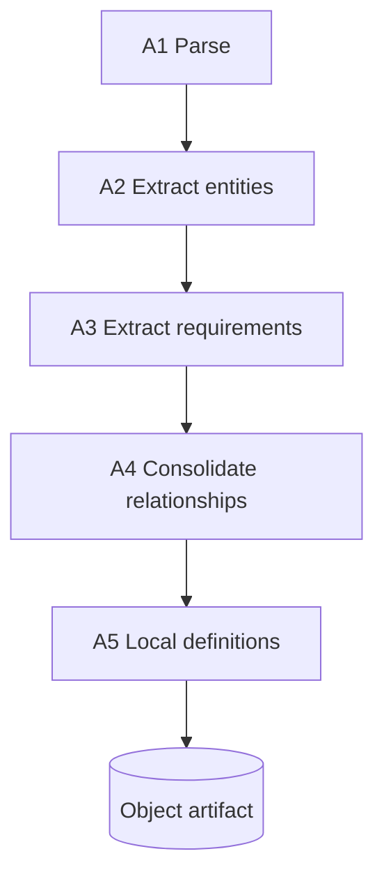

# Compilation

Compilation is the first phase of the [compiler](./compiler.md#compiler). It runs on one
documentation file at a time. Files are compiled independently and in parallel, then handed to
[linking](./linking.md#linking).

Each file compiles to one [object artifact](./artifacts/object-artifact.md#object-artifact): the
file's sections, the entities and requirements extracted from it, the relationships those
requirements imply, and the local definition of each entity. This is the per-file unit the linker
resolves across files.

## Properties

- Per file. One file in, one object artifact out.
- Parallel. Files do not depend on each other during compilation.
- Cacheable. Each step is keyed and cached in its [stage file](./artifacts.md#storage-layout). An
  unchanged file is not recompiled; a changed file reruns only the stages whose inputs changed.
- Small scope. Each step gives the LLM the smallest input that works (one section, or one entity),
  never the whole project. Narrow inputs are more reliable, see [main](../main.md).

## Steps

- [A1 Parse](./compilation/parse.md#parse): split the file into a section tree. Deterministic.
- [A2 Extract entities](./compilation/extract-entities.md#extract-entities): find the entities mentioned in the file.
- [A3 Extract requirements](./compilation/extract-requirements.md#extract-requirements): extract EARS requirements and the edges they imply.
- [A4 Consolidate relationships](./compilation/consolidate-relationships.md#consolidate-relationships): merge those edges into relationships.
- [A5 Local definitions](./compilation/local-definitions.md#local-definitions): write each external entity's local definition.

The result is the [object artifact](./artifacts/object-artifact.md#object-artifact).
