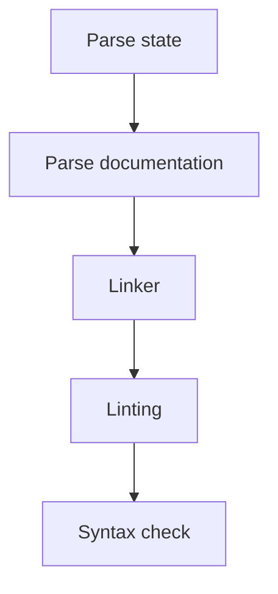

# Compilation

## Overview

The core compilation process is implemented as a Rust library. Given an input project, it
runs through several stages to produce final artifacts with optional warning(s). Compilation
may also fail and produce error(s) instead.

The following are the stages of the compilation process:

## Process

## Step 1: Parse state

TODO:
- Find existing compiled state
- Verify not corrupted, surface warnings/errors if any

## Step 2: Parse documentation

See [Docs Parser](./compilation/docs-parser.md#documentation-parser)

TODO:
- Find all documentation files based on glob
- Parse documentation files with built-in or custom handlers
- Surface warnings/errors if any

## Step 3: Linker

TODO:
- Find changelog of inserts/updates/deletes (optionally moves)

## Step 4: Linting

TODO:
- For each section:
  - Warn if not grammatically correct
  - Warn if not consistent

## Step 5: Syntax check

TODO:
- For each changed section:
  - Check if section makes sense
  - Check if section is not ambiguous or inconsistent
- 

