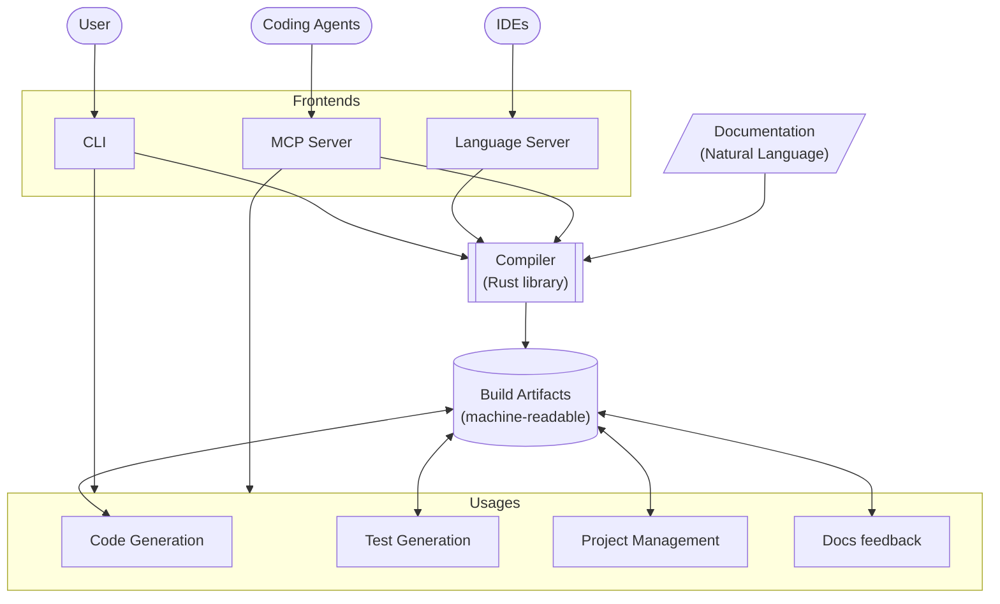

# Jazyk
https://jazyk.org

**Nat**ural **Lan**gauge as a programming language.

## Preamble

Natural language or ordinary language is any language that humans use to communicate
amongst each other. This project introduces a new higher-level programming language that
allows developers to define software in natural language.

Compared to common programming languages, Natural Language is flexible and allows for a
wide range of interpretations, making it difficult to define and construct software
out of it, if not properly constrained.

The syntax of Natural Languages such as English is already defined. Rather than constraining it,
we introduce a compiler that surfaces ambiguity, open-endedness, and contradictions in its usage.

### Read–eval–print loop

In current world, LLMs are invoked with short and well-defined prompts to produce more reliable outcomes.

An open-ended prompt becomes exponentially less reliable.
(e.g. "pelican on bicycle as SVG", "build me Facebook")

What if open-endedness is not the target we are aiming for?

Programming languages are constrained by their syntax and semantics. English language can describe
ambiguity. The prompts are unreliable because we are using natural language with ambiguity.

In a way, a "coding agent" (e.g. Claude Code) are a form of REPL, a way to interact with an LLM one
statement at a time to produce an incremental result.

If coding agent is a REPL, and a prompt is a single programming statement, than what does an entire
program look like?

Disregard the flexibility of natural language to produce ambiguous statements, there is no CPU instruction
to "build me a Facebook" or "draw me a pelican" so let's restrict our language to be well-defined.

Imagine requirements doc and UML diagrams as a programming language.

## Architecture

### Site

The project's public site is hosted at [jazyk.org](https://jazyk.org).

[See More](./site.md)

### Compiler

The compiler is the core of this project, a library that turns natural-language documentation into
machine-readable [build artifacts](./compiler/artifacts.md#build-artifacts), surfacing
ambiguity, open-endedness, and contradictions along the way.

[See More](./compiler.md)

### Frontends

Frontends embed the compiler and expose it for different consumers.

- [CLI](./cli.md)
- [Language Server](./lsp.md)
- [MCP Server](./mcp.md)

### Consumers

Usages consume the build artifacts to do useful work downstream.

- [Project Management](./pm.md)
- [Code Generation](./codegen.md)
- [Test Generation](./testgen.md)
- [LLM Static Analysis](./llm-test.md)
- [Documentation Generation](./docsgen.md)
